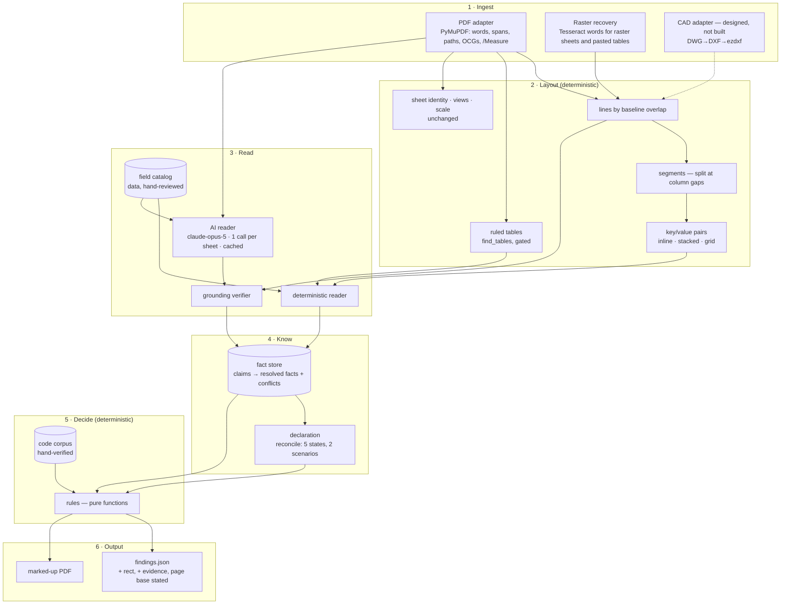
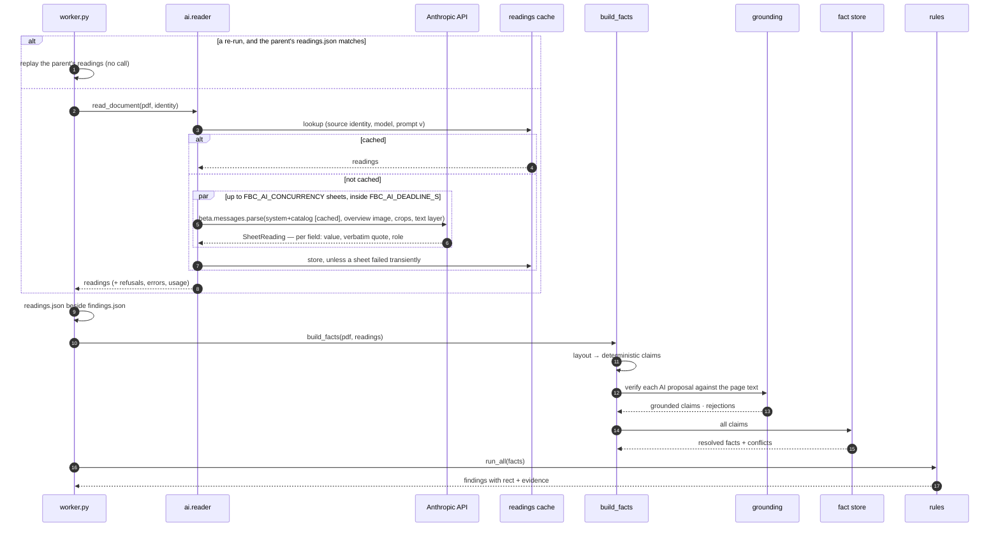
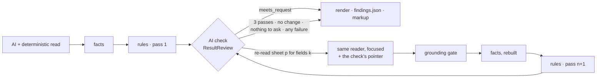

# Architecture v2 — AI reads, rules decide

[`ENGINE-TEARDOWN.md`](ENGINE-TEARDOWN.md) is the "before": what the engine does,
measured on the real Sculpted Hot Pilates set, and the ten structural reasons it
reproduces 4 of 14 hand-review findings. This is the "after".

## 0. The decision

The owner chose, on 2026-09-27, between three designs:

| Option | What it is | Chosen |
| --- | --- | --- |
| Deterministic only | rebuild layout, lexicon and fact store; zero model calls | no |
| **Hybrid — AI reads, rules decide** | a vision model reads each sheet once per upload and proposes located values; a deterministic verifier accepts only what it can find on the sheet; hand-verified tables and pure-Python rules make every compliance call | **yes** |
| AI-first | a model reviews the set against the code and writes the findings | no |

`CLAUDE.md` no longer says "the review path makes zero LLM calls". It says what
the model may and may not do, in §1 below, and those rules are enforced by tests.

The deterministic core is not a fallback bolted on afterwards: most of what the
engine misses today is live vector text it lays out wrongly (teardown §3). The
layout layer and fact store are built first, the AI reader sits beside the
deterministic reader, and both write into the same store under the same checks.

---

## 1. Guardrails

1. **AI reads; rules decide.** A model's output can only ever become a *claim* —
   "this value is printed at this place on this sheet". It never becomes a
   finding, a severity, a code threshold, a citation or an abstention reason.
   Rules are pure functions of the fact store and the code corpus.
2. **Grounded or discarded.** Every proposal carries a verbatim quote. The
   grounding verifier must find that quote on that page's text layer — live text
   or OCR — inside a compact region, and must re-derive the value from the quote
   with the same parser the deterministic reader uses. A proposal that fails is
   recorded for audit and never reaches a rule.
3. **Deterministic floor.** With AI reading switched off, unconfigured, over
   budget, refused or failing, the review completes on the deterministic reader
   alone. An AI failure is a smaller review, never a failed one.
4. **Replayable.** Every set's readings are stored with the job
   (`outputs/{job}/readings.json`) and cached by `(source identity, model,
   prompt version)` — the source identity being the upload's SHA-256, or for a
   set rebuilt from scanned sheets the upload's plus the rebuild's parameters,
   because PyMuPDF writes a fresh document ID on every save and rebuilt bytes
   never repeat. A pass with a transient failure (an API error, the deadline) is
   stored with its job but not cached, so the next upload tries those sheets
   again. Re-runs and the regression gate replay stored readings; no test makes
   a network call.
5. **Provenance is shown.** A value located by the model says so on the
   finding card: *read by AI, verified on sheet G-1*. A value two readers found
   independently says that too, and earns HIGH confidence.
6. **The rule layer cannot reach the model.** `fbcreview/rules` and
   `fbcreview/codes` never import `fbcreview.ai` or `anthropic`; a test walks the
   import graph.
7. **The five properties in `CLAUDE.md` still hold.** Abstention stays honest,
   every value carries provenance, an inferred value never masquerades as a
   stated one, the code corpus stays hand-transcribed, the regression gate holds.
8. **AI checks; it cannot change a result.** Added 2026-09-28 at the owner's
   direction (§4.1). After the rules run, a reviewer model checks the result
   against what the user asked for and the sheets' text. It can send named
   sheets back to be read again for named catalog facts — what comes back is
   grounded like any reading — or leave a note for the audit record. It cannot
   add, remove, edit or re-rank a finding. Three passes at most; a failed check
   leaves the last pass standing.

---

## 2. The layers



Package layout:

```
fbcreview/
  layout/            words · lines · segments · pairs · tables     (new)
  read/              catalog (data) · claims · deterministic reader (new)
  ai/                schema · prompt · reader · grounding · readings (new)
  factstore.py       claims → resolved facts, conflicts             (new)
  extract/           sheet identity, scale, views, schedules, code rows (kept)
  reconcile.py       declaration vs drawn — drawn side now from the fact store
  rules/  codes/     pure; never import ai/
```

---

## 3. Layer by layer

### 3.1 Ingest

- **PDF adapter.** PyMuPDF words with their boxes and font size, per page.
  Unchanged dependency, pinned at 1.28.2.
- **Raster recovery.** `webapp/convert.py` already OCRs raster sheets and
  pasted-table regions and writes the words back as invisible text. That text is
  what the grounding verifier checks a model's reading of a pasted table
  against, so on a set like ITEC the model and OCR are two readers of the same
  pixels, and a value is accepted only where they agree.
- **CAD adapter.** Designed in §5, not built.

### 3.2 Layout

The single change that fixes most of the teardown. Instead of a rectangle and a
y-grid per extractor, every page gets one layout, built once:

1. **Lines by baseline overlap.** Two words are on one line when their vertical
   extents overlap by more than half the smaller height — not when their y
   rounds into the same 5-pt bucket. (`SPRINKLER SYSTEM` at y 969.3 and `YES` at
   966.9 are one line.)
2. **Segments.** A line splits wherever the horizontal gap exceeds ~1.5 × the
   line's text height. A segment is a run of words that belong together: a
   label, a value, a column cell. Two tables side by side become separate
   segments, so they can no longer merge.
3. **Pairs**, three shapes, all with the label's and value's boxes kept:

   | Shape | Printed as | Example on the real set |
   | --- | --- | --- |
   | inline | `LABEL: value` in one segment, or label segment → value segment on one line | G-1 `OCCUPANT LOAD` … `70` |
   | stacked | `LABEL:` on one line, the value directly beneath it | G-0 `OCCUPANCY:` / `ASSEMBLY (A-3)` |
   | grid | a label followed by several value columns under column headers | G-0 `COMMON PATH OF TRAVEL (1006.2.1):` · `50 LF` · `8'-1"` under `REQUIRED:` / `PROVIDED:` |

4. **Ruled tables** through `find_tables()`, only on pages whose text names a
   table the catalog asks about — it costs about a second a page.

### 3.3 Read

**The field catalog** (`fbcreview/read/catalog.py`) is data in the same
hand-reviewed style as the code corpus: for each fact the rules consume, its
key, the label phrasings that name it, the words that disqualify a label
(`SITE AREA` is not the building area; `OCCUPANT LOAD FACTOR` is not the load),
its value parser and its unit. It replaces `_PATTERNS` — a vocabulary instead of
a regex per phrasing — and it is also what the AI reader is told to look for, so
the two readers answer the same questions.

**The deterministic reader** matches every pair's label against the catalog and
parses the value. A code row with a section citation also becomes a claim for
the egress field its section governs, so G-0's `50 LF (1006.2.1)` and G-1's
`MAX. COMMON PATH 75 LF` are two claims about one fact — and a conflict.

**The AI reader** (`fbcreview/ai/reader.py`) — one request per sheet:

| Aspect | Choice | Why |
| --- | --- | --- |
| Model | `claude-opus-5` (`FBC_AI_MODEL`) | current default; reading drafted code blocks is not a task to economise on |
| Input | the sheet's text layer as positioned segments + one overview image of the sheet + a high-resolution crop of every pasted raster region | the text layer is exact on vector sheets and is what quotes are checked against; the image gives layout; crops are the only way into a pasted table |
| Output | structured output (`messages.parse` + Pydantic `SheetReading`): fields and code rows, each with a verbatim quote | a schema, not prose |
| Prompt | system prompt + catalog, cached (`cache_control`) across the set's sheets; `PROMPT_VERSION` in the cache key | ~24 calls share one prefix |
| Refusals | `fallbacks: "default"` (beta `server-side-fallback-2026-07-01`); a sheet still refused is skipped | floor, not failure |
| Concurrency | `FBC_AI_CONCURRENCY` (default 6) | a 24-sheet set in a few waves |
| Budget | `FBC_AI_MAX_SHEETS`, per-request timeout, whole-set deadline | a stuck sheet cannot hold a review |
| Switch | `FBC_AI_READING=on` **and** an API key; otherwise off | nothing leaves the deployment unless it is configured to |

The model is told to transcribe, not to judge: no compliance opinions, no
inferred values, quote exactly as printed, omit anything it cannot see.

**The grounding verifier** (`fbcreview/ai/grounding.py`), per proposal:

1. Tokenise the quote the way page words are tokenised.
2. Find every occurrence of the quote's rarest token on the page; around each,
   take the nearest occurrence of every other token.
3. Accept the tightest cluster if it holds every token (live text) or ≥ 80 % of
   tokens at ≤ 1 edit each (OCR text), and its box is compact — a label and its
   value, not two ends of a sheet.
4. Re-parse the value from the quoted text with the catalog parser. The parsed
   value must equal the proposed value.
5. Emit a claim with `method="ai"`, the cluster box as its location, and the
   quote. Otherwise record the rejection and why.

### 3.4 Know — the fact store

```mermaid
flowchart LR
    C1[claim · G-0 · stacked pair<br/>OCCUPANCY: ASSEMBLY A-3<br/>deterministic] --> R{resolve}
    C2[claim · G-0 · quote 'OCCUPANCY: ASSEMBLY (A-3)'<br/>ai, grounded] --> R
    C3[claim · G-1 · 'OCCUPANCY CLASSIFICATION: GROUP A'<br/>deterministic] --> R
    R --> F[occupancy_group = A-3<br/>HIGH — two readers agree<br/>A agrees: less specific]
    D1[claim · G-0 grid row 1006.2.1<br/>50 LF] --> R2{resolve}
    D2[claim · G-1 inline pair<br/>MAX. COMMON PATH 75 LF] --> R2
    R2 --> K[egress.common_path_limit<br/>CONFLICT across sheets: 50 vs 75]
```

- A **claim** is `(field, value, raw text, sheet, page, box, method, basis,
  confidence)`. `basis` is `stated`, `tabulated`, `computed` or `measured`
  (the inference-ladder rungs); `method` is `pair`, `table`, `code-row`,
  `legacy` or `ai`.
- **Resolution**: claims are grouped by normalised value, using the same
  `reconcile.agree` the declaration uses, so `A` and `A-3` agree and `II-B` and
  `Type IIB` agree. One group → resolved; two independent readers or two sheets
  → HIGH. Several groups → a **conflict**: the value from the code-analysis
  sheet is taken as the set's statement, and every group is kept, with its
  sheets and quotes, for a rule to report.
- **No defaults, anywhere.** A fact nobody stated resolves to nothing, and a rule
  that needs it abstains saying which fact and that the set was read for it.
  `legacy_context`'s `A-3` / sprinklered fallback is deleted.

### 3.5 Reconciliation

Unchanged in meaning (teardown §5). The drawn side of every declaration field
now comes from the fact store, with `_PATTERNS` kept only as a last resort for a
field the store holds nothing about, so no set loses a value it used to read.

### 3.6 Rules

Pure functions, as before, with three changes:

- They read resolved facts and locate their finding **where the evidence is** —
  the sheet, page and box of the claim — instead of a hard-coded `page 0`, `"G-0"`.
- Their prose is templated from the facts (`with` / `without` a sprinkler
  system; the actual sheet codes), so it is true of the set in front of them.
- New checks close the register's deterministic gaps: cross-sheet disagreement
  on a stated code value (H-02's second half), the two-factor egress analysis
  (M-02), the occupant-load posting sign in assembly (M-05), exits required and
  provided (V-04).

As built (Phase D):

| Rule | Reads | Register |
| --- | --- | --- |
| `_stated.stated()` (all Chapter 10 rules) | the section's block row, else the layout's required/provided claims for the same row | V-04 |
| `EGRESS.COMMON_PATH` | also names another sheet stating a different requirement | H-02, whole |
| `EGRESS.FACTOR_CONSISTENCY` | `EXIT DISCHARGE n` blocks (`read/groups.py`) against the requirement's factor | M-02 |
| `EGRESS.CEILING_HEIGHT` | ceiling tags on the reflected ceiling plan (`read/tags.py`) against 1003.2 | V-17 |
| `EGRESS.OCCUPANT_LOAD_POSTING` | every sheet's text, for an assembly occupancy (1004.9) | M-05 |
| `DOORS.CLEAR_WIDTH_REQUIREMENT` | the stated 1010.1.1 row | V-05 |
| `MECH.OUTDOOR_AIR_ARITHMETIC` | the outdoor-air table re-read inside its own box (`read/tables.py`) | V-35 |
| `PLUMB.FIXTURE_COUNT` | the PLUMBING COUNTS block (`read/plumbing.py`) against Table 2902.1 | V-06 |
| `OCC.CLASSIFICATION_CONSISTENCY` | occupant-load table rows (`read/groups.py`) against the Table 1004.5 function the set's own words name | H-01, L-01 |
| `XSHEET.STATED_CONFLICT` | every value the fact store read on more than one sheet | — |

### 3.7 Code corpus

Hand-transcribed, as before. Table 506.2 is re-transcribed from the code text
(teardown §7), with the source cited in the module. Table 2902.1 gains its first
row — A-3, auditoriums without permanent seating … gymnasiums — checked against
the 2023 FBC-B text on 2026-09-27; a set on any other row abstains and names the
table.

### 3.8 Output contract

Backward compatible — every existing field keeps its meaning. `Finding.to_dict()`
is unchanged (the baselines hold it byte for byte); `fbcreview/payload.py` adds
what the viewer needs when `findings.json` is written, for the worker and
`run.py --json` alike:

| Field | Meaning | Consumer |
| --- | --- | --- |
| `key` | unique within one review — `fid` is not (two under-width doors are two H-03s; a divergence is two findings with one fid) | everything the client tracks, maps, selects or focuses; feedback still says `fid` |
| `rect` | where to draw the marker on the **source** PDF, in pdf.js viewport space at scale 1 (points, origin top-left, rotation applied): the rule's own `box` where it knows the row, else the renderer's anchor search, else where its evidence was read; null when it cannot be placed or the finding exists only as declared | the viewer draws it directly; `anchor`/`hit` stay the fallback for an older review |
| `evidence` | the readings the rule's inputs rest on: field, role, value, quote as printed, sheet, 0-based page, rect, method, confidence, and a note when the AI reader found it | the register and the finding card show *where it was read and by what* |
| page base | `page` stays 0-based everywhere (the renderer depends on it); the client converts in one place, `viewerPage()` in `web/src/app/viewer/findings.ts` | fixes teardown §8.1 |

`Finding.box` is the placement hint behind `rect` — the table row H-01 is about,
not the first place "MAT STUDIO" is printed — and the renderer uses it too, so
the live viewer and the downloaded PDF mark the same place. `Summary.ai_reading`
carries the reader's counts, and `/api/config` says whether AI reading is on, so
the client claims "zero model calls" only where it is true.

---

## 4. One review with AI reading on



### 4.1 The result check — read, decide, check, at most three passes

Decided by the owner on 2026-09-28: an initial AI reader, the pure-Python rules,
then an AI reviewer that looks at the finished result and checks it is what was
asked for; if it is not, the review is repeated — three passes at most — and
everything else about the output stays as it was.



- **What the check sees** (`fbcreview/ai/review.py`, `packet`): the review
  options and declaration — what the user asked for, with any email address
  dropped — the findings and abstentions, the facts the rules used, the AI
  values the sheet check rejected, earlier re-reads in this review, and each
  sheet's text (6 k characters a sheet, 90 k a set).
- **What it can say** (`schema.ResultReview`): `meets_request`, `rereads`
  (page, catalog keys, a hint) and `notes`. Nothing else; a test holds the key
  set, as it does for `FieldReading`.
- **What a re-read is**: `reader.read_document(focus=…)` — the same request for
  those sheets only, with the check's facts and pointer appended, never cached.
  Its values are merged into the set's readings and grounded like any other, so
  a pointer at a value the sheet does not print changes nothing.
- **What stops it**: the check is satisfied (`meets_request`); the pass limit
  (`max_passes`, `FBC_AI_MAX_PASSES`, held at 3 by the loop itself); a re-read
  that changes nothing (`no_change`); nothing the check may ask for — unknown
  page, unknown key, already re-read (`nothing_to_reread`); a check or re-read
  that fails (`review_failed`, `reread_failed`). The last pass stands in every
  case, so the check can only ever make a review more complete.
- **Notes** go to `ai_review.json` with the job — the audit record — and never
  into a finding, the markup or a log. `summary.ai_review` carries counts only.
- **Replay**: `ai_review.json` holds every check and every re-read. A re-run
  whose readings match replays it with no call and reaches the same findings;
  `run.py --review` does the same from the command line.

---

## 5. The CAD adapter — designed, build later

A permit set arrives as PDF; the DWG behind it, when a client shares it, is far
richer. The adapter produces the same layout input as the PDF adapter, so
nothing downstream changes.

| DWG/DXF entity | Becomes |
| --- | --- |
| `TEXT`, `MTEXT`, `ATTRIB` | words with model-space boxes — exact, no OCR |
| `INSERT` with attributes | a symbol: door tag + width, room tag + name + area |
| `LWPOLYLINE` (closed) on room/area layers | room polygons — spatial association and area by shoelace, at 1:1 |
| `DIMENSION` | a measured value with its definition points |
| layers | the real layer table, so geometry rules stop guessing names |
| layouts / viewports | sheets and their scales, directly |

Pipeline: `DWG → DXF` with a converter, then `ezdxf` (MIT). Converter options
and their constraints:

- **ODA File Converter** — free download, proprietary licence; confirm the terms
  permit use inside a hosted service before shipping it in the container.
- **LibreDWG `dwg2dxf`** — GPL-3.0; server-side use is not distribution, but the
  quality varies by DWG version.
- **Autodesk Platform Services (Model Derivative)** — hosted, paid, and sends
  the client's drawing to a third party.

Build it when there is a real DWG of a reference set to test against — the same
reproduce-before-you-change rule as everything else.

---

## 6. Testing

| Gate | What it proves |
| --- | --- |
| `tests/test_reference_sets.py` | the real Sculpted set (and ITEC, when present) under pytest — the gate `test_regression.py` never was; its scorecard floor only rises |
| `tests/test_sheet_checks.py` | each Phase D check against its input, drawn at the real set's geometry |
| `tests/test_ai_guardrails.py` | rules never import `ai`; a review with AI off completes; an ungrounded claim never reaches a rule; the same readings give the same findings |
| `tests/test_ai_reader.py` | the reader's request, through the real SDK over a mock transport; refusal, error, deadline, sheet limit, cache |
| `tests/test_worker_ai.py`, `tests/test_cli.py` | the worker stage and `run.py --ai` / `--readings`, with readings built in code — no test makes a network call |
| `tests/test_ai_review.py`, `tests/test_worker_ai_review.py` | the result check: it can say nothing but re-reads and notes; re-read values are grounded; the result is always the rules' own over the final readings; never more than three passes; every failure keeps the last pass; a stored trace replays with no call |
| `scripts/scorecard.py` | how much of the hand review the engine reproduces — the number to move |

---

## 7. Risks

| Risk | Mitigation |
| --- | --- |
| Client drawings leave the deployment | off unless configured; per-deployment switch; the Anthropic API does not train on API data by default; retention per the org's agreement |
| Cost per review | one call per sheet, cached prefix, cached readings per file hash; a re-run of the same file costs nothing |
| Latency | concurrency, a whole-set deadline, and the deterministic floor |
| The model misreads a value | it cannot enter the store unless the quote is on the sheet and the value re-parses from it |
| The model reads a value from the wrong row | the quote pins label and value together; a quote spanning two rows fails the compactness check |
| Prompt injection via sheet text | the model's output is data validated against a schema and the page; it has no tools and nothing it says is executed or trusted |

---

## 8. Status

| Phase | What | Scorecard on Sculpted (open / verified, exact) |
| --- | --- | --- |
| before | the engine as found (`docs/ENGINE-TEARDOWN.md` §11) | 4 / 14 · 5 / 36 |
| A | layout layer: each sheet laid out once, label/value pairs in three shapes | — |
| B | field catalog, deterministic reader, fact store; no hidden A-3 / sprinklered defaults; Table 506.2 corrected | 6 / 14 · 5 / 36 |
| C | the AI reader, grounding verifier, readings cache and replay, worker stage, `run.py --ai` | unchanged with AI off, by design |
| D | stated-row fallback, findings anchored where their evidence is, eight new checks, a false-conflict fix | 10 / 14 · 10 / 36 |
| E | frontend conformance: one page base, unique keys, `rect` placement (30/30 findings placed on Sculpted), evidence on cards, the AI stage and summary | unchanged, by design |
| F | the real ITEC Alico Park set | pending — needs the PDF |
| G | the result check: AI reviewer, focused re-reads, up to three passes, `ai_review.json` replay (§4.1) | unchanged with AI off, by design |

Of the four open register entries still missed, three (M-06 interior finish
classes, M-07 the accessible counter, M-08 trap seal protection) need checks on
details and schedules this build does not read yet. The fourth, L-02, does not
reproduce on the 8.18.2026 PDF: M-1 labels the 2 CFM row STORAGE, 14 SF at
0.12 CFM/SF, which is consistent. `scripts/scorecard.py` still counts it, and
says why it is disputed.
