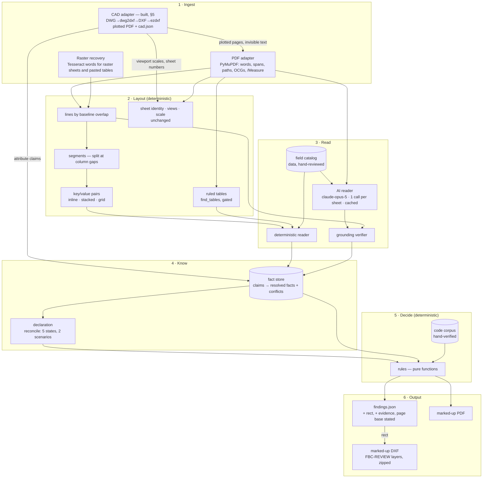
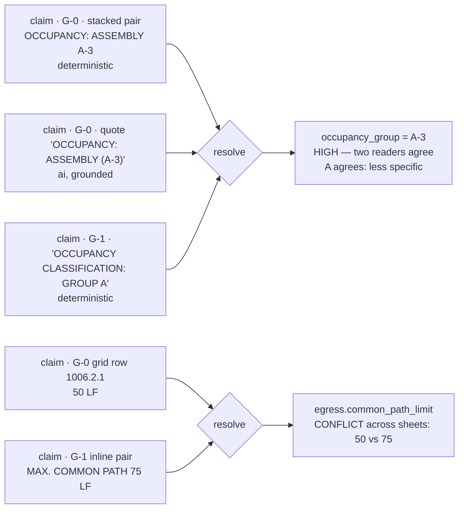
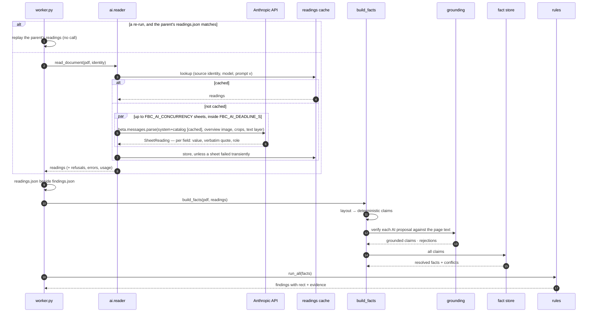
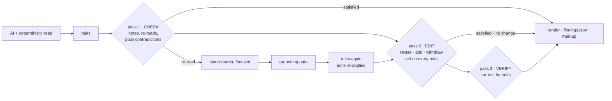
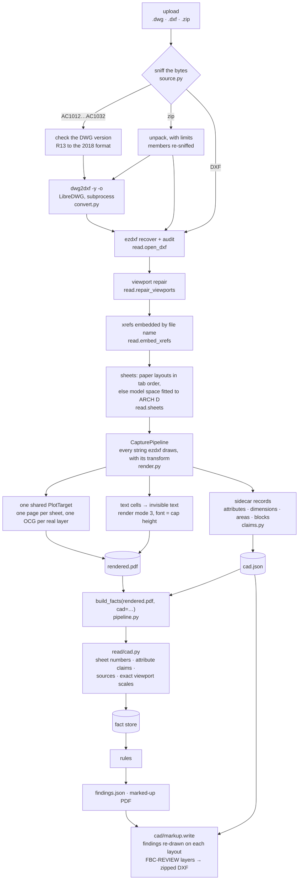

# Architecture v2 — AI reads, rules decide

[`ENGINE-TEARDOWN.md`](ENGINE-TEARDOWN.md) is the "before": what the engine does,
measured on the real Sculpted Hot Pilates set, and the ten structural reasons it
reproduces 4 of 14 hand-review findings. This is the "after".

## 0. The decision

The owner chose, on 2026-09-27, between three designs:

| Option | What it is | Chosen |
| --- | --- | --- |
| Deterministic only | rebuild layout, lexicon and fact store; zero model calls | no |
| **Hybrid — AI reads, rules decide** | a vision model reads each sheet once per upload and proposes located values; a deterministic verifier accepts only what it can find on the sheet; hand-verified tables and pure-Python rules make every compliance call | **yes** |
| AI-first | a model reviews the set against the code and writes the findings | no |

`CLAUDE.md` no longer says "the review path makes zero LLM calls". It says what
the model may and may not do, in §1 below, and those rules are enforced by tests.

The deterministic core is not a fallback bolted on afterwards: most of what the
engine misses today is live vector text it lays out wrongly (teardown §3). The
layout layer and fact store are built first, the AI reader sits beside the
deterministic reader, and both write into the same store under the same checks.

---

## 1. Guardrails

1. **AI reads; rules decide.** A model's output can only ever become a *claim* —
   "this value is printed at this place on this sheet". It never becomes a
   finding, a severity, a code threshold, a citation or an abstention reason.
   Rules are pure functions of the fact store and the code corpus.
2. **Grounded or discarded.** Every proposal carries a verbatim quote. The
   grounding verifier must find that quote on that page's text layer — live text
   or OCR — inside a compact region, and must re-derive the value from the quote
   with the same parser the deterministic reader uses. A proposal that fails is
   recorded for audit and never reaches a rule.
3. **Deterministic floor.** With AI reading switched off, unconfigured, over
   budget, refused or failing, the review completes on the deterministic reader
   alone. An AI failure is a smaller review, never a failed one.
4. **Replayable.** Every set's readings are stored with the job
   (`outputs/{job}/readings.json`) and cached by `(source identity, model,
   prompt version)` — the source identity being the upload's SHA-256, or for a
   set rebuilt from scanned sheets the upload's plus the rebuild's parameters,
   because PyMuPDF writes a fresh document ID on every save and rebuilt bytes
   never repeat. A pass with a transient failure (an API error, the deadline) is
   stored with its job but not cached, so the next upload tries those sheets
   again. Re-runs and the regression gate replay stored readings; no test makes
   a network call.
5. **Provenance is shown.** A value located by the model says so on the
   finding card: *read by AI, verified on sheet G-1*. A value two readers found
   independently says that too, and earns HIGH confidence.
6. **The rule layer cannot reach the model.** `fbcreview/rules` and
   `fbcreview/codes` never import `fbcreview.ai` or `anthropic`; a test walks the
   import graph.
7. **The five properties in `CLAUDE.md` still hold.** Abstention stays honest,
   every value carries provenance, an inferred value never masquerades as a
   stated one, the code corpus stays hand-transcribed, the regression gate holds.
8. **AI reviews and corrects the result.** Added 2026-09-28 at the owner's
   direction and amended the same day to let the reviewer change findings
   directly (§4.1). After the rules run, a reviewer model may revise, add or
   withdraw findings, send sheets back to be read, and leave notes — check,
   edit, verify, three passes at most. Every applied edit is labelled on the
   finding; adding, withdrawing or moving a severity or status needs a quote
   printed on the sheet; a withdrawn finding becomes an abstention; the code
   corpus is never touched; a failed pass keeps the last good state.

---

## 2. The layers



Package layout:

```
fbcreview/
  layout/            words · lines · segments · pairs · tables     (new)
  read/              catalog (data) · claims · deterministic reader (new)
  ai/                schema · prompt · reader · grounding · readings (new)
  factstore.py       claims → resolved facts, conflicts             (new)
  extract/           sheet identity, scale, views, schedules, code rows (kept)
  reconcile.py       declaration vs drawn — drawn side now from the fact store
  cad/               DWG/DXF/zip -> plotted PDF + cad.json; marked-up DXF  (2026-10-03)
  read/cad.py        cad.json -> sheet numbers, attribute claims, exact viewport scales
  rules/  codes/     pure; never import ai/ or cad/
```

---

## 3. Layer by layer

### 3.1 Ingest

- **PDF adapter.** PyMuPDF words with their boxes and font size, per page.
  Unchanged dependency, pinned at 1.28.2.
- **Raster recovery.** `webapp/convert.py` already OCRs raster sheets and
  pasted-table regions and writes the words back as invisible text. That text is
  what the grounding verifier checks a model's reading of a pasted table
  against, so on a set like ITEC the model and OCR are two readers of the same
  pixels, and a value is accepted only where they agree.
- **CAD adapter.** Built (§5). A DWG, a DXF or a zip of them is plotted to a
  PDF with an invisible text layer of the drafter's own strings, so it enters
  through the PDF adapter like any set; what a plot cannot carry (title-block
  attributes, each viewport's exact scale, the layer table) rides beside it in
  `cad.json`.

### 3.2 Layout

The single change that fixes most of the teardown. Instead of a rectangle and a
y-grid per extractor, every page gets one layout, built once:

1. **Lines by baseline overlap.** Two words are on one line when their vertical
   extents overlap by more than half the smaller height — not when their y
   rounds into the same 5-pt bucket. (`SPRINKLER SYSTEM` at y 969.3 and `YES` at
   966.9 are one line.)
2. **Segments.** A line splits wherever the horizontal gap exceeds ~1.5 × the
   line's text height. A segment is a run of words that belong together: a
   label, a value, a column cell. Two tables side by side become separate
   segments, so they can no longer merge.
3. **Pairs**, three shapes, all with the label's and value's boxes kept:

   | Shape | Printed as | Example on the real set |
   | --- | --- | --- |
   | inline | `LABEL: value` in one segment, or label segment → value segment on one line | G-1 `OCCUPANT LOAD` … `70` |
   | stacked | `LABEL:` on one line, the value directly beneath it | G-0 `OCCUPANCY:` / `ASSEMBLY (A-3)` |
   | grid | a label followed by several value columns under column headers | G-0 `COMMON PATH OF TRAVEL (1006.2.1):` · `50 LF` · `8'-1"` under `REQUIRED:` / `PROVIDED:` |

4. **Ruled tables** through `find_tables()`, only on pages whose text names a
   table the catalog asks about — it costs about a second a page.

### 3.3 Read

**The field catalog** (`fbcreview/read/catalog.py`) is data in the same
hand-reviewed style as the code corpus: for each fact the rules consume, its
key, the label phrasings that name it, the words that disqualify a label
(`SITE AREA` is not the building area; `OCCUPANT LOAD FACTOR` is not the load),
its value parser and its unit. It replaces `_PATTERNS` — a vocabulary instead of
a regex per phrasing — and it is also what the AI reader is told to look for, so
the two readers answer the same questions.

**The deterministic reader** matches every pair's label against the catalog and
parses the value. A code row with a section citation also becomes a claim for
the egress field its section governs, so G-0's `50 LF (1006.2.1)` and G-1's
`MAX. COMMON PATH 75 LF` are two claims about one fact — and a conflict.

**The AI reader** (`fbcreview/ai/reader.py`) — one request per sheet:

| Aspect | Choice | Why |
| --- | --- | --- |
| Model | `claude-opus-5` (`FBC_AI_MODEL`) | current default; reading drafted code blocks is not a task to economise on |
| Input | the sheet's text layer as positioned segments + one overview image of the sheet + a high-resolution crop of every pasted raster region | the text layer is exact on vector sheets and is what quotes are checked against; the image gives layout; crops are the only way into a pasted table |
| Output | structured output (`messages.parse` + Pydantic `SheetReading`): fields and code rows, each with a verbatim quote | a schema, not prose |
| Prompt | system prompt + catalog, cached (`cache_control`) across the set's sheets; `PROMPT_VERSION` in the cache key | ~24 calls share one prefix |
| Refusals | `fallbacks: "default"` (beta `server-side-fallback-2026-07-01`); a sheet still refused is skipped | floor, not failure |
| Concurrency | `FBC_AI_CONCURRENCY` (default 6) | a 24-sheet set in a few waves |
| Budget | `FBC_AI_MAX_SHEETS`, per-request timeout, whole-set deadline | a stuck sheet cannot hold a review |
| Switch | `FBC_AI_READING=on` **and** an API key; otherwise off | nothing leaves the deployment unless it is configured to |

The model is told to transcribe, not to judge: no compliance opinions, no
inferred values, quote exactly as printed, omit anything it cannot see.

**The grounding verifier** (`fbcreview/ai/grounding.py`), per proposal:

1. Tokenise the quote the way page words are tokenised.
2. Find every occurrence of the quote's rarest token on the page; around each,
   take the nearest occurrence of every other token.
3. Accept the tightest cluster if it holds every token (live text) or ≥ 80 % of
   tokens at ≤ 1 edit each (OCR text), and its box is compact — a label and its
   value, not two ends of a sheet.
4. Re-parse the value from the quoted text with the catalog parser. The parsed
   value must equal the proposed value.
5. Emit a claim with `method="ai"`, the cluster box as its location, and the
   quote. Otherwise record the rejection and why.

### 3.4 Know — the fact store



- A **claim** is `(field, value, raw text, sheet, page, box, method, basis,
  confidence)`. `basis` is `stated`, `tabulated`, `computed` or `measured`
  (the inference-ladder rungs); `method` is `pair`, `table`, `code-row`,
  `legacy` or `ai`.
- **Resolution**: claims are grouped by normalised value, using the same
  `reconcile.agree` the declaration uses, so `A` and `A-3` agree and `II-B` and
  `Type IIB` agree. One group → resolved; two independent readers or two sheets
  → HIGH. Several groups → a **conflict**: the value from the code-analysis
  sheet is taken as the set's statement, and every group is kept, with its
  sheets and quotes, for a rule to report.
- **No defaults, anywhere.** A fact nobody stated resolves to nothing, and a rule
  that needs it abstains saying which fact and that the set was read for it.
  `legacy_context`'s `A-3` / sprinklered fallback is deleted.

### 3.5 Reconciliation

Unchanged in meaning (teardown §5). The drawn side of every declaration field
now comes from the fact store, with `_PATTERNS` kept only as a last resort for a
field the store holds nothing about, so no set loses a value it used to read.

### 3.6 Rules

Pure functions, as before, with three changes:

- They read resolved facts and locate their finding **where the evidence is** —
  the sheet, page and box of the claim — instead of a hard-coded `page 0`, `"G-0"`.
- Their prose is templated from the facts (`with` / `without` a sprinkler
  system; the actual sheet codes), so it is true of the set in front of them.
- New checks close the register's deterministic gaps: cross-sheet disagreement
  on a stated code value (H-02's second half), the two-factor egress analysis
  (M-02), the occupant-load posting sign in assembly (M-05), exits required and
  provided (V-04).

As built (Phase D):

| Rule | Reads | Register |
| --- | --- | --- |
| `_stated.stated()` (all Chapter 10 rules) | the section's block row, else the layout's required/provided claims for the same row | V-04 |
| `EGRESS.COMMON_PATH` | also names another sheet stating a different requirement | H-02, whole |
| `EGRESS.FACTOR_CONSISTENCY` | `EXIT DISCHARGE n` blocks (`read/groups.py`) against the requirement's factor | M-02 |
| `EGRESS.CEILING_HEIGHT` | ceiling tags on the reflected ceiling plan (`read/tags.py`) against 1003.2 | V-17 |
| `EGRESS.OCCUPANT_LOAD_POSTING` | every sheet's text, for an assembly occupancy (1004.9) | M-05 |
| `DOORS.CLEAR_WIDTH_REQUIREMENT` | the stated 1010.1.1 row | V-05 |
| `MECH.OUTDOOR_AIR_ARITHMETIC` | the outdoor-air table re-read inside its own box (`read/tables.py`) | V-35 |
| `PLUMB.FIXTURE_COUNT` | the PLUMBING COUNTS block (`read/plumbing.py`) against Table 2902.1 | V-06 |
| `OCC.CLASSIFICATION_CONSISTENCY` | occupant-load table rows (`read/groups.py`) against the Table 1004.5 function the set's own words name | H-01, L-01 |
| `XSHEET.STATED_CONFLICT` | every value the fact store read on more than one sheet | — |

### 3.7 Code corpus

Hand-transcribed, as before. Table 506.2 is re-transcribed from the code text
(teardown §7), with the source cited in the module. Table 2902.1 gains its first
row — A-3, auditoriums without permanent seating … gymnasiums — checked against
the 2023 FBC-B text on 2026-09-27; a set on any other row abstains and names the
table.

### 3.8 Output contract

Backward compatible — every existing field keeps its meaning. `Finding.to_dict()`
is unchanged (the baselines hold it byte for byte); `fbcreview/payload.py` adds
what the viewer needs when `findings.json` is written, for the worker and
`run.py --json` alike:

| Field | Meaning | Consumer |
| --- | --- | --- |
| `key` | unique within one review — `fid` is not (two under-width doors are two H-03s; a divergence is two findings with one fid) | everything the client tracks, maps, selects or focuses; feedback still says `fid` |
| `rect` | where to draw the marker on the **source** PDF, in pdf.js viewport space at scale 1 (points, origin top-left, rotation applied): the rule's own `box` where it knows the row, else the renderer's anchor search, else where its evidence was read; null when it cannot be placed or the finding exists only as declared | the viewer draws it directly; `anchor`/`hit` stay the fallback for an older review |
| `evidence` | the readings the rule's inputs rest on: field, role, value, quote as printed, sheet, 0-based page, rect, method, confidence, and a note when the AI reader found it | the register and the finding card show *where it was read and by what* |
| page base | `page` stays 0-based everywhere (the renderer depends on it); the client converts in one place, `viewerPage()` in `web/src/app/viewer/findings.ts` | fixes teardown §8.1 |

`Finding.box` is the placement hint behind `rect` — the table row H-01 is about,
not the first place "MAT STUDIO" is printed — and the renderer uses it too, so
the live viewer and the downloaded PDF mark the same place. `Summary.ai_reading`
carries the reader's counts, and `/api/config` says whether AI reading is on, so
the client claims "zero model calls" only where it is true.

---

## 4. One review with AI reading on



### 4.1 The result review — check, edit, verify, at most three passes

Decided by the owner on 2026-09-28: an initial AI reader, the pure-Python rules,
then an AI reviewer that makes sure the result is what was asked for, repeating
the review when it is not — three passes at most — with the output otherwise
unchanged. Amended the same day: the reviewer may change findings directly, and
its second pass is the active one.



- **What it sees** (`fbcreview/ai/review.py`, `packet`): this pass's job, the
  review options and declaration (email dropped), every finding with its key
  and any AI label so far, the abstentions, the facts the rules used, the AI
  values the sheet check rejected, what earlier passes noted and edited, and
  each sheet's text (6 k characters a sheet, 90 k a set).
- **What it can say** (`schema.ResultReview`): `edits` (`FindingEdit`: revise,
  add or withdraw, with severity, status, title, result, remedy, citation, page,
  quote, reason), `rereads`, `notes`, `meets_request`. Tests hold the key sets.
- **What an edit must carry** (`apply_edits`): a reason, always. A quote printed
  on the page — found by the grounding gate's own locator — to add or withdraw a
  finding or to move its severity or status; wording-only revisions need none.
  Severity and status must agree (a PASS carries VERIFIED; an OPEN finding a
  problem severity). An edit that fails is recorded with why, and not applied.
- **How it shows**: the finding's `result` ends with *[Revised by AI review,
  pass n: reason]* or *[Raised by AI review…]*, so the marked-up PDF says it;
  `findings.json` carries `ai_revision` (op, pass, reason, changed fields, what
  the severity and status were, quote, page); the client shows it on the card.
  An added finding has rule id `AI.REVIEW`, fid `AI-nn`, and says it is not
  from the hand-verified corpus. A withdrawn finding becomes an abstention.
- **The passes**: pass 1 checks and hands problems on as notes, and the loop
  continues to pass 2 even when pass 1 changed nothing; pass 2 is told to be
  active and to act on every note; pass 3 verifies the edits. After pass 1, a
  pass that changes nothing ends the loop. Re-reads re-run the rules, and the
  accepted edits are re-applied on top of the new result.
- **Order**: rules → AI review → calibration, so a promoted calibration profile
  still has the last word.
- **Replay**: `ai_review.json` holds every answer and re-read; validation is
  deterministic, so a re-run replays it with no call to the same findings.

---

## 5. The CAD adapter — built 2026-10-03

A permit set usually arrives as PDF; the DWG behind it, when a client shares
it, is far richer. §5 was designed with the rule that it would be built only
against a real drawing, and there is one now: `EVERGREEN_BLDG_1.dwg`, an
AutoCAD 2018-format precast set, 23 MB, eight layouts, about 296 000
model-space entities. Every number below was measured on it. The drawing is a
client file and lives in the git-ignored `samples/`; tests build their own
drawings in code with ezdxf.

The design held in one respect and changed in another. It held: **the engine
downstream does not change** — a drawing is turned into the PDF the engine
already reads, and the layout layer, both readers, the rules and the viewer
take it unchanged. It changed: the adapter does not hand the layout layer
words directly. It *plots* each sheet and lays the drafter's exact strings back
over the plot as invisible text, because a plot is what a person reviews, what
the viewer shows and what a finding's `rect` points into, and because every
existing reader already speaks PDF.

### 5.1 The pipeline as built



| Stage | Where | What it does, and why |
| --- | --- | --- |
| Sniff | `fbcreview/cad/source.py` | Decides PDF, DWG, DXF or zip from the leading bytes, never the file name. A DWG older than R13 is refused with that reason. A zip is unpacked with limits on member count, total size and compression ratio, refuses paths that climb out, and keeps only members that sniff as drawings. |
| Convert | `fbcreview/cad/convert.py` | `dwg2dxf` as a subprocess with a timeout (`FBC_DWG_TIMEOUT_S`). Its stderr is reduced to counts by kind, because LibreDWG quotes handles and names. |
| Read | `fbcreview/cad/read.py` | `ezdxf.recover` plus an audit, so a slightly damaged file still opens. Units from `$INSUNITS`, or inferred (and labelled inferred) where AutoCAD itself infers them. |
| Repair | `read.repair_viewports` | LibreDWG writes status 0 on the viewports it converts (65 of 71 on the reference drawing), and ezdxf, correctly by the DXF reference, skips a viewport with status below 1 — every sheet plotted as a title block over an empty frame. Status is rebuilt from the separate "viewport off" flag; a file whose statuses are already set is left alone. |
| Sheets | `read.sheets` | A sheet is a paper layout with something drawn on it, in tab order. A drawing with none is plotted from model space as one sheet, fitted to ARCH D, and says so. |
| Plot | `fbcreview/cad/render.py` | ezdxf's PyMuPDF backend draws each sheet as vectors with every CAD layer as an optional-content group, into one shared document, so the set has one layer table with the real names. |
| Text | `render.cells` / `write_cells` | ezdxf draws text as glyph outlines, so the plot has no text layer. `CapturePipeline` records every string as it is drawn — TEXT, MTEXT, ATTRIB, dimension text, model-space notes seen through a viewport — with the exact transform, and writes it back invisible, in cells joined the way the layout layer reads them. |
| Sidecar | `fbcreview/cad/claims.py` → `cad.json` | What the plot cannot carry, per page: title-block attributes with tag and prompt, dimension text beside measured length, closed outlines on area layers with measured area, each viewport's exact scale and model→page map, a block inventory, the layer table. |
| Into the engine | `pipeline.build_facts(path, cad=)` → `fbcreview/read/cad.py` | Sheet numbers, attribute claims (method `cad`), source stamps on every claim read off a drawn sheet, exact per-viewport scales. With `cad=None` the review is byte-identical to before. |
| Back into the drawing | `fbcreview/cad/markup.py` | Re-opens each drawing's DXF and draws every finding on the layout it was found on, at the place `findings.json`'s `rect` says, through the inverse of that page's map: revision clouds on `FBC-REVIEW` for findings that need action, rectangles on `FBC-REVIEW-VERIFIED` for checks that passed, ids and titles on `FBC-REVIEW-TEXT`, each outline's identity in XDATA under `FBC_REVIEW`. Zipped. It follows the marked-up PDF's labelling rules word for word. |
| Process boundary | `webapp/cadjob.py`, `python -m fbcreview.cad` | Ingest and markup each run in a subprocess, at most `FBC_CAD_CONCURRENCY` at once per instance, each under `FBC_CAD_TIMEOUT_S`: the gigabyte a large drawing takes is returned on exit, a converter crash costs a subprocess, and a deadline can kill it. Nothing the subprocess prints is logged; the log gets counts and an outcome code. |

### 5.2 What each entity became

| DWG/DXF entity | Designed to become | Built as |
| --- | --- | --- |
| `TEXT`, `MTEXT`, `ATTRIB`, dimension text | words with model-space boxes | the drafter's strings as invisible text on the plotted page, where the plot puts them, read by the layout layer like any PDF text |
| `ATTRIB` / `ATTDEF` in a title block | — | the sheet number, only from a field whose tag or prompt says it is the sheet number (`SHEET_NO`, `DWG No.`, a prompt `SHEET No. (1)`) — never a layout tab name |
| `ATTRIB` whose tag names a catalog field | a symbol | a claim through `claims_from_pair`, method `cad`, basis stated, naming the entity and layout |
| `VIEWPORT` | sheets and their scales | an exact `ViewScale` per viewport with HIGH evidence; a page with viewports at several scales abstains from a page-wide scale |
| layers | the real layer table | the layer names in `facts.meta["cad_layers"]` and as the plotted page's OCGs, so geometry rules see real names |
| `DIMENSION` | a measured value | a sidecar record: printed text beside measured length. **No rule reads it yet.** |
| closed outline on an area layer | room polygon and area | a sidecar record, basis measured. **No rule reads it yet.** |
| `INSERT` | door tag, room tag | a block inventory per drawing |

### 5.3 Decisions

| Decision | When, by whom | Why |
| --- | --- | --- |
| **LibreDWG `dwg2dxf`** as the converter, run as a separate unmodified program | owner, 2026-10-03 | ODA File Converter is proprietary and hosted commercial use appears to need a membership; Autodesk Platform Services is paid per translation and sends every client drawing to Autodesk. LibreDWG is GPL-3.0, runs in the container, and converted the reference drawing in 4–7 s. Running it as a program the service calls, not a library it links, is what keeps the licence question to the converter alone; `docs/DEPLOYMENT.md` §9a has the obligations if the image is ever distributed. |
| A real DWG is the test reference | owner, 2026-10-03 | The reproduce-before-you-change rule. Every repair below is a fault measured on it, not anticipated. |
| Outputs: the marked-up PDF report **and** a marked-up DXF | owner, 2026-10-03 | The PDF is the review of record a plans examiner reads; the DXF is the same review for the drafter who fixes the drawing, on layers that can be frozen or deleted without touching their work. |
| ASCII DXF, not binary | measured | `dwg2dxf -b` reads back twice as fast and truncates every text-style and linetype name to one character and drops every block attribute — 0 against 1 088. |
| Success judged by the output, not the exit code | measured | `dwg2dxf` reports ~1 700 `ERROR` lines on the reference drawing and exits 0; nearly all are fields the review never reads, and the drawing reads back whole. |
| Invisible text at font size = cap height (`FONT_PER_CAP = 1.0`), squeezed to the ink width | measured | PyMuPDF reports a Helvetica word box 1.374 × the font size tall, and the layout layer drops a stacked value whose box overlaps its label's by more than a quarter of that. 1.0 × cap reads every stacked pitch a drafter uses down to 1.1 × cap; Helvetica at the visible cap height loses single-line TEXT stacked at 1.25 × cap. Never shrunk to fit width, which would change the box height every threshold is a multiple of. |
| Sheet numbers only from title-block fields | design | A layout tab name is the drafter's working label (`Layout3`, `PLAN-REV`), not what the sheet prints. A sheet whose title block has no such field keeps the PDF path's identification. |
| Measured values never under catalog keys | design, CLAUDE.md | A measured area or dimension length is arithmetic on the drawing, not a statement the set makes. It stays in the sidecar labelled measured; a rule that takes a stated value never sees it. The inference ladder (`FEATURE-PROMPT-inference-ladder.md`) is where measured values earn a rule, on a rung of their own. |
| Source-aware independence | design | `factstore.independent` clusters claims by the drawing entity behind them. The layout reader reading an ATTRIB's text off the plot and the CAD reader reading the same ATTRIB are one reading, and one model-space note seen through viewports on two sheets is one reading — agreeing with yourself is not corroboration. |
| AI readings cached by what the reader saw | design, then measured | A rendered PDF's bytes never repeat, so its hash cannot key the readings cache. The identity (`ai/readings.py`, `plotted_identity`) is the upload's SHA-256 plus the converter that ran, the ezdxf and plotter versions, and a digest of the text layer's words and boxes — the digest because one plotter edit changed every page's text layer under an unchanged version string. Computed from the sidecar and the PDF, so the service never imports ezdxf for it. |
| A damaged zip member costs that drawing, not the set | 2026-10-03, this build | Forty sheet files should not lose thirty-nine to one bad file. A member that cannot be converted or read is left out with a warning naming it (`unread` in the sidecar); an xref that failed says *unreadable*, never *not uploaded*. Only when no member can be read is the upload refused, with the first member's reason. A single-drawing upload has nothing else to review, so its failure is the job's. |
| A layout that cannot be plotted costs that sheet | 2026-10-03, this build | Same reasoning, one level down. Any page it began is removed, so page *N* of the PDF stays page *N* of the sidecar, and the warning names the layout. |
| A sheet number printed on several sheets is kept, and reported | measured | The reference drawing's title blocks give `SZ-1` on three layouts — a title block copied and not renumbered. What is printed is what the sheet is called, so each keeps it; a warning names the layouts, because every finding on them names the same sheet. |
| One review holds at most 300 MB of DXF (`FBC_CAD_MAX_DXF_MB`) | measured | 170 MB of DXF peaked at 1.13 GB. Every member of a zip is open at once while xrefs resolve, and on Cloud Run the DXF also sits on the in-memory disk; past the budget the subprocess would be killed and reported as an unreadable drawing. The size is known the moment the DXF exists, so the refusal comes then and says what it is. The zip's own unpack cap (1 GB) sits above it for the same reason. |

### 5.4 Measured on the reference drawing

| Step | Measured |
| --- | --- |
| `dwg2dxf` | 4–7 s; 23 MB DWG → 170 MB ASCII DXF |
| ezdxf read (recover + audit) | ~60 s |
| model-space bounding-box index | ~17 s |
| plotting | 3–15 s per sheet |
| whole ingest, 8 sheets | ~188 s, 1.13 GB peak RSS (in its subprocess) |
| DXF markup | ~85 s (re-reads the DXF) |
| outputs | `rendered.pdf` 5 MB; marked-up DXF zip 14.5 MB |

Those numbers set the deployment: Cloud Run memory 4 GiB, one drawing at a
time per instance, and an upload limit that makes a DWG — or a zipped DXF — the
practical form to send (`docs/DEPLOYMENT.md` §3, §6, §9a).

### 5.5 What it deliberately does not do yet

- **No dimension-override check.** A dimension whose printed text disagrees
  with the length it measures is a classic drafting error, and the sidecar
  holds both numbers. No rule compares them yet: a finding needs a tolerance
  and a citation, and those are deliberate corpus work, not a side effect.
- **No rule on measured areas.** Closed outlines on area layers are measured and
  recorded, `basis = measured`. Using them is the inference ladder's measured
  rung, with its own labelling — not a shortcut around it.
- **MULTILEADER text depends on proxy graphics.** ezdxf 1.4.4's renderer draws a
  MULTILEADER only from the proxy graphics the saving application stored with
  it (its frontend lists `MULTILEADER` among the proxy-graphic-only entities).
  On the reference drawing all 802 MULTILEADERs in the converted DXF carry them,
  so their notes reach the plot and the text layer. A drawing whose leaders
  carry none would plot their notes as nothing, and the review does not yet say
  so.
- **No Revit.** A `.rvt` is closed to everything but Autodesk's own software and
  cloud. Revit users export sheets to DWG today (`docs/CAD-INPUT.md`); reading
  Revit's native IFC export is a separate, planned path
  (`docs/FEATURE-PROMPT-revit-ifc.md`).
- **No region selection.** A review covers every sheet. Selecting a region of a
  drawing to review is planned in `docs/FEATURE-PROMPT-cad-region-plugin.md`.

---

## 6. Testing

| Gate | What it proves |
| --- | --- |
| `tests/test_reference_sets.py` | the real Sculpted set (and ITEC, when present) under pytest — the gate `test_regression.py` never was; its scorecard floor only rises |
| `tests/test_sheet_checks.py` | each Phase D check against its input, drawn at the real set's geometry |
| `tests/test_ai_guardrails.py` | rules never import `ai`; a review with AI off completes; an ungrounded claim never reaches a rule; the same readings give the same findings |
| `tests/test_ai_reader.py` | the reader's request, through the real SDK over a mock transport; refusal, error, deadline, sheet limit, cache |
| `tests/test_worker_ai.py`, `tests/test_cli.py` | the worker stage and `run.py --ai` / `--readings`, with readings built in code — no test makes a network call |
| `tests/test_ai_review.py`, `tests/test_worker_ai_review.py` | the result review: revise, add and withdraw apply and are labelled; an edit without a quote on the sheet is not applied; a withdrawal is an abstention; pass 2 acts on pass 1's notes; never more than three passes; every failure keeps the last good state; a stored trace replays with no call |
| `tests/test_cad_ingest.py`, `tests/test_cad_overlay.py`, `tests/test_factstore_cad.py` | drawings built in code with ezdxf (`tests/fixtures/cad_drawings.py`), read end to end: one page per drawn layout in tab order, repaired viewports and their exact scales, sheet numbers only from title-block fields; the invisible text layer pairs labels and values the way a plotted PDF does, never fuses words and lies over its ink; one entity read twice is one reading, and a PDF's claims behave exactly as before |
| `tests/test_cad_reference.py` | the real reference drawing through LibreDWG, ingest and the engine, holding the measured numbers — including what the drawing does *not* state, on which the review must abstain. Opt-in (`FBC_CAD_REFERENCE=1`, about three minutes and a gigabyte) and only where the drawing and `dwg2dxf` both are; skipped in CI |
| `tests/test_cad_source.py`, `tests/test_cad_upload.py` | a drawing upload is recognised by its bytes, an old DWG or a hostile zip is refused at the door with a typed reason, a DWG on a deployment with no converter is refused rather than half-read |
| `tests/test_worker_cad.py`, `tests/test_cli_cad.py` | a DXF built in code goes through the subprocess, the engine and both outputs; converter failures and timeouts become typed errors, not crashes; logs carry counts, never names — with a stand-in converter, so CI needs no LibreDWG |
| `tests/test_cad_markup.py` | each finding is re-drawn on the layout it was found on, around what it is about, on a plain, a 90°-rotated and a model-space sheet; nothing is added to any other layout; the PDF's labelling rules hold in the DXF |
| `tests/test_cad_provenance.py`, `tests/test_cad_followups.py` | a value read from a drawing says so on the finding; one entity read twice is not two readings; a measured value never shows as a printed quote; a plotted sheet's report never claims the drawing was untouched |
| `tests/test_container_cad.py` | the image builds LibreDWG from the checksummed GNU release, ships `dwg2dxf` and a font, pins ezdxf exactly, and both deploy paths size for a drawing — read from the files, no Docker needed |
| `scripts/scorecard.py` | how much of the hand review the engine reproduces — the number to move |

---

## 7. Risks

| Risk | Mitigation |
| --- | --- |
| Client drawings leave the deployment | off unless configured; per-deployment switch; the Anthropic API does not train on API data by default; retention per the org's agreement |
| Cost per review | one call per sheet, cached prefix, cached readings per file hash; a re-run of the same file costs nothing |
| Latency | concurrency, a whole-set deadline, and the deterministic floor |
| The model misreads a value | it cannot enter the store unless the quote is on the sheet and the value re-parses from it |
| The model reads a value from the wrong row | the quote pins label and value together; a quote spanning two rows fails the compactness check |
| Prompt injection via sheet text | the model's output is data validated against a schema and the page; it has no tools and nothing it says is executed or trusted |
| A drawing carries more than its sheets — every layer, every xref | stored like a PDF upload (private bucket, signed URLs, lifecycle delete); the converted DXF stays in the job's scratch directory and is never stored; the AI reader is shown the plotted sheets, not the drawing |
| The converter is C code parsing an untrusted binary format | run as a subprocess, as the unprivileged service user, with a timeout and one at a time per instance; a crash fails that job with a typed error and costs the service nothing |

---

## 8. Status

| Phase | What | Scorecard on Sculpted (open / verified, exact) |
| --- | --- | --- |
| before | the engine as found (`docs/ENGINE-TEARDOWN.md` §11) | 4 / 14 · 5 / 36 |
| A | layout layer: each sheet laid out once, label/value pairs in three shapes | — |
| B | field catalog, deterministic reader, fact store; no hidden A-3 / sprinklered defaults; Table 506.2 corrected | 6 / 14 · 5 / 36 |
| C | the AI reader, grounding verifier, readings cache and replay, worker stage, `run.py --ai` | unchanged with AI off, by design |
| D | stated-row fallback, findings anchored where their evidence is, eight new checks, a false-conflict fix | 10 / 14 · 10 / 36 |
| E | frontend conformance: one page base, unique keys, `rect` placement (30/30 findings placed on Sculpted), evidence on cards, the AI stage and summary | unchanged, by design |
| F | the real ITEC Alico Park set | pending — needs the PDF |
| G | the result review: AI reviewer that edits findings directly (labelled, evidenced), focused re-reads, check / edit / verify, `ai_review.json` replay (§4.1) | unchanged with AI off, by design |
| H | the CAD adapter (§5): DWG, DXF and zip uploads plotted to the reviewed PDF with the drafter's text as an invisible layer; title-block sheet numbers, attribute claims and exact viewport scales from the drawing; a marked-up DXF beside the PDF report. Built and measured on a real AutoCAD 2018 drawing | unchanged on a PDF, by design — `build_facts(cad=None)` is byte-identical |

Of the four open register entries still missed, three (M-06 interior finish
classes, M-07 the accessible counter, M-08 trap seal protection) need checks on
details and schedules this build does not read yet. The fourth, L-02, does not
reproduce on the 8.18.2026 PDF: M-1 labels the 2 CFM row STORAGE, 14 SF at
0.12 CFM/SF, which is consistent. `scripts/scorecard.py` still counts it, and
says why it is disputed.
