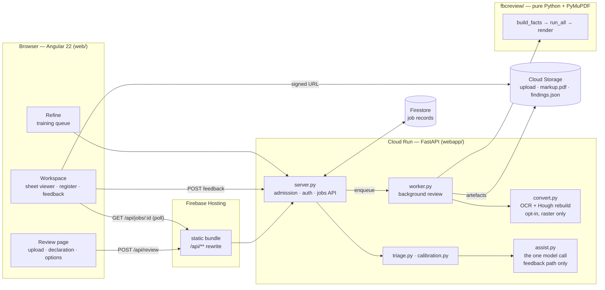
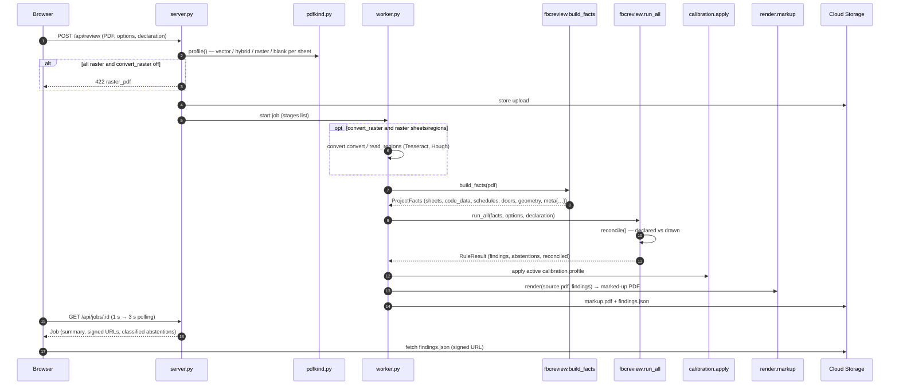
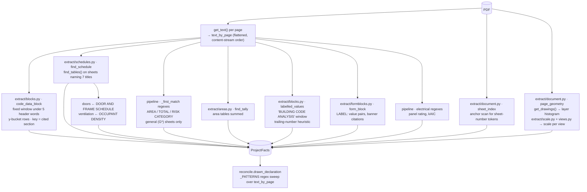
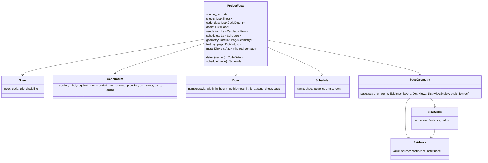
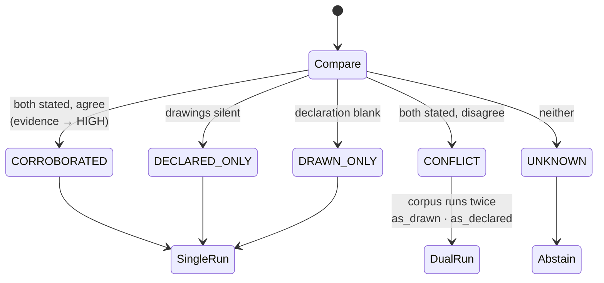
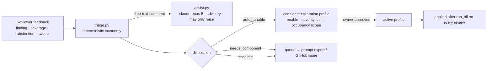

# The engine as built — a teardown

This document takes the review engine apart as it stood on `main` at `0a944d6`
(2026-09-27), measures it against the real Sculpted Hot Pilates permit set, and
names the structural reasons it misses. It is the "before" half of
[`ARCHITECTURE-V2.md`](ARCHITECTURE-V2.md), which is the redesign.

Every number here was produced by running the code, not by reading it:

```
python run.py "samples/SCULPTED HOT PILATES - PERMIT SET 8.18.2026.pdf"
python scripts/scorecard.py "samples/SCULPTED HOT PILATES - PERMIT SET 8.18.2026.pdf"
FBC_TEST_PDF="samples/…pdf" python tests/test_regression.py
```

---

## 0. The short version

| Measure | Value |
| --- | --- |
| Sheets / CAD layers preserved | 24 / 200 |
| Rules registered | 31 |
| Findings / abstentions on the real set | 13 / 20 |
| Wall-clock for one review | **9.6 s** (the docs claim ~2 s) |
| Hand-review open findings reproduced | **4 of 14** (C-01, H-02, H-03, M-04) |
| Hand-review verified items reproduced | **5 of 36** |
| Real-set regression gate | **failing** — 2 of 10 expectations lost since commit `55e1a67` (26 Aug) |
| Abstentions that claim the set is silent about a value printed on G-0 or G-1 | 7 of 20 |

The two numbers that matter most are the last two. The engine had silently lost
two findings it used to produce, and nobody knew, because
`tests/test_regression.py` defines `main()` and no `test_*` function — pytest
collects it and runs nothing. And a third of what the review tells a reviewer it
"could not check" is printed in plain vector text on the first two sheets.

---

## 1. System context



The engine is invoked by exactly one caller in production — `webapp/worker.py`
— and by `run.py` on the command line.

---

## 2. One review, end to end



---

## 3. Inside `build_facts` — the extraction layer

`fbcreview/pipeline.py::build_facts` runs these steps in order. Every one is a
separate strategy with its own window, its own tokenisation and its own
vocabulary, and several of them read the same fact.



| Extractor | Strategy | Feeds | What it did on the real set |
| --- | --- | --- | --- |
| `document.sheet_index` | every sheet-number-shaped token bucketed by position; the most-recurring cell is the title block | `Sheet(code, title)` | **Correct on 24/24.** The one extractor that generalises well, because it votes across the whole set. |
| `scale.resolve` + `views.py` | `/Measure` viewports ∩ printed `X" = 1'-0"` labels; multi-scale sheets segmented into views | `PageGeometry` | 13/24 page-wide, 12 at HIGH; views resolve more. Sound design. |
| `blocks.code_data_block` | fixed window under the lowest of 5 header words; words bucketed by `round(y/5)`; rows keyed by `(1006.2.1)` | `code_data` | 6 cited rows off G-0's EGRESS block. Works because that block puts the citation on every row. |
| `blocks.labelled_values` | window under "BUILDING CODE ANALYSIS"; value = trailing run of numeric tokens | `occupant_load`, `sprinklered`, `stated_capacity_factor` | **Broken.** See §3.1. |
| `formblocks.form_block` | `LABEL: value` pairs split at colons or the widest gap; banner citations | fallbacks for the three above | Reads the G-1 block's neighbour tables instead; no colons in the block itself. |
| `schedules.find_schedule` | `find_tables()` on sheets whose text names one of 7 schedule titles | doors, RTU, panel, load calc, OA | Recovers all 7. `split_merged_row` repairs the merged OA row. |
| `_first_match` area/risk regexes | literal `AREA:?\s*([\d,]+)\s*SF` over **G-series sheets only** | `area_g0_sf`, `area_g1_sf`, `risk_category` | Reads 1,436 and 1,375 correctly — on a set whose general sheets happen to be G-0/G-1. |
| `reconcile._PATTERNS` | 15 fields × literal regexes over flattened page text | every declaration field (drawn side) | Misses sprinklers, wind speed, the A-3 subgroup. See §3.2. |

### 3.1 The occupant load that went missing

G-1 prints a `BUILDING CODE ANALYSIS` block. Its label column sits at x ≈ 1732,
its values at x ≈ 1928–1943, and a second table (FFPC occupant load) is printed
**beside it** at x ≈ 2056–2250 with rows on nearly the same baselines:

```
( 1732.0,  987.3) OCCUPANT LOAD            ( 1943.3,  984.7) 70
                                           ( 2236.4,  983.3) OCCUPANT   ← neighbour table header
( 1732.0,  969.3) SPRINKLER SYSTEM         ( 1940.3,  966.9) YES
```

Two independent failures, both structural:

1. **The window grew into the neighbour.** Commit `55e1a67` made every window
   proportional to the sheet (sound in itself: a fixed 340 pt window crops a
   36×24 sheet). On this sheet the window became 720 pt wide, reached the FFPC
   table, and its header words landed in the same y-bucket. The row became
   `OCCUPANT LOAD 70 OCCUPANT LOAD`, whose last token is not a number, so the
   trailing-number heuristic returned nothing. With the old window the same call
   returns `{'OCCUPANT LOAD': '70', …}`.
2. **Fixed y-buckets split rows.** `SPRINKLER SYSTEM` (y 969.3) and `YES`
   (y 966.9) straddle a 5-pt bucket boundary, so they are two rows and neither
   is a pair. Even with the old window, 4 of the block's 13 rows were read.

`page.find_tables()` recovers the same block as a clean two-column table
(`OCCUPANT LOAD | 70`, `WIDTH REQUIRED | 10.50"`, `MAX. COMMON PATH | 75 LF` …)
because it follows the block's own ruling.

**Consequence:** `EGRESS.CAPACITY_FACTOR` (M-01) and `XSHEET.RISK_CATEGORY`
(M-03) abstain with "occupant load not extracted". Both were in the regression
expectations.

### 3.2 Values printed on G-0 that the sweep cannot see

G-0's `PROJECT DATA` block is **stacked** — each label on one line, its value on
the line beneath, at the same x — and interleaved with the "applicable codes"
column on its left and the sheet index on its right:

```
TYPE OF CONSTRUCTION:     (1875, 985.8)
III-B                     (1874, 1009.0)
OCCUPANCY:                (1875, 1032.4)
ASSEMBLY (A-3)            (1875, 1055.8)
FIRE SPRINKLERS:          (1875, 1079.2)
SPRINKLERED               (1875, 1102.4)
BASIC WIND SPEED:         (1875, 1172.4)
ULTIMATE: 170 MPH         (1875, 1195.7)
RISK CATEGORY:            (1875, 1289.3)
III                       (1875, 1312.6)
```

`reconcile._PATTERNS` reads flattened text with literal regexes:

| Printed | Pattern that should have read it | Why it did not |
| --- | --- | --- |
| `FIRE SPRINKLERS:` / `SPRINKLERED` | `SPRINKLER…[:=]\s*(NFPA13…\|YES\|NO\|NONE)` | the answer is the word `SPRINKLERED`, not in the alternation |
| `BASIC WIND SPEED:` / `ULTIMATE: 170 MPH` | `WIND SPEED\s*[:=]\s*(\d{2,3})\s*MPH` | a sub-label (`ULTIMATE:`) sits between the label and the number |
| `OCCUPANCY:` / `ASSEMBLY (A-3)` | `OCCUPANCY…[:=]\s*([A-Za-z][A-Za-z\-\s]{0,24}?)…` | the capture cannot include `(`, so it fails and falls through to G-1's `GROUP A` — the subgroup is lost |

So the register says of sprinklers and wind speed: *"neither the drawings nor
the declaration state this"*. That sentence is false, and it is the specific
failure `CLAUDE.md` names as the one that must never happen.

---

## 4. The fact model



The typed classes cover schedules, doors and code rows. Everything else — the
occupant load, sprinkler status, both building areas, the risk category, panel
rating, OA totals, form rows, the area tally, the options, the reconciled
declaration and the scenario — travels in `meta`, an untyped dict with 25+ keys
whose names encode the sheet the value was *expected* on (`area_g0_sf`,
`area_g1_sf`). Only `PageGeometry` carries `Evidence`; a door width or an
occupant load arrives at a rule with no record of where on the sheet it was read.

---

## 5. Declared versus drawn



The reconciliation design is sound and survives into v2 unchanged: two sources,
five states, never a default, exactly two scenarios. Its weakness is upstream —
the drawn side comes from `_PATTERNS` (§3.2), so `DRAWN_ONLY` and `CONFLICT` are
only as good as fifteen regexes.

---

## 6. The rule corpus (31 rules)

| Family | Rules | Inputs | Notes |
| --- | --- | --- | --- |
| Egress (code-block audit) | `EGRESS.COMMON_PATH`, `.TRAVEL_DISTANCE`, `.DEAD_END`, `.CORRIDOR_WIDTH`, `.CAPACITY_FACTOR`, `.EXIT_COUNT` | cited `CodeDatum` + group + sprinklers + occupant load | group/sprinklers come from `legacy_context` — see §10.3 |
| Occupancy | `EGRESS.OCCUPANT_LOAD_COMPUTED` | group, area or occupant table | abstains for Group A (no single gross factor) |
| Doors | `DOORS.CLEAR_WIDTH` | door schedule leaf widths | fid `H-03` for any door, `M-03b` for bifolds |
| Mechanical | `MECH.OUTDOOR_AIR_CAPACITY` | OA table total, RTU schedule | reads `rtu.rows[0]` only |
| Electrical | `ELEC.PANEL_LOADING` | load calc amperage, panel rating | |
| Cross-sheet | `XSHEET.BUILDING_AREA`, `XSHEET.RISK_CATEGORY` | `area_g0_sf`, `area_g1_sf`, RC, OL | **hard-wired to page 0 and the words "G-0" and "the G-1 occupancy tables"** |
| Chapter 5 | `HEIGHT_AREA.TABLE_504_HEIGHT`, `…_504_STORIES`, `…_506_AREA`, `FIRE.TABLE_601` | reconciled building facts | Table 506.2 data is wrong (§7) |
| Structural / code | `STRUCT.WIND_STANDARD`, `CODE.EDITION_CURRENT` | edition, Vult | |
| Declaration | 11 × `DECL.*` | one reconciled field each | fire only on CONFLICT / CORROBORATED |
| Measurement | `MEASURE.EGRESS_EXTENT` | paths on a layer named `egress path` | re-opens the PDF inside the rule |
| Identification | `DOC.SHEET_NUMBERS` | sheet index | |

Every finding id, most titles and much of the prose come from the hand register
for this one set: `H-02` is always "Common path requirement understated on
{sheet}", `EGRESS.CAPACITY_FACTOR` always says "No EVACS appears anywhere in
this set", `EGRESS.COMMON_PATH` always says "with a sprinkler system" whatever
`SPRINKLERED` is.

---

## 7. The code corpus

`fbcreview/codes/fbc2023.py` is the part meant to be trusted because it is
hand-transcribed. Checked against the 2023 FBC-B text on
[UpCodes](https://up.codes/viewer/florida/fl-building-code-2023/chapter/5/general-building-heights-and-areas):

| Table | Status |
| --- | --- |
| 504.3 heights, groups A B E F M S U | correct |
| 504.4 storeys, B · A-3 · M · S-1 | correct |
| **506.2 area factors** | **every sprinklered value wrong.** The corpus carries S1 = 3×NS and SM = 2×NS; the code is S1 = 4×NS and SM = 3×NS (B/II-B is 23,000 / **92,000** / **69,000**, not 23,000 / 69,000 / 46,000). **A-3/III-B NS is 9,500, not 8,500.** Sculpted is A-3/III-B, sprinklered, one storey: the corpus would print an allowable of 25,500 SF on a *VERIFIED* card; the code says 38,000. |
| 601 | spot-checked, consistent |
| 1004.5 gross factors | business 150, mercantile 60 (IBC 2021 basis) consistent |
| 1006.2.1 common path | Group B non-sprinklered carries one value (75); the table splits at an occupant load of 30 (100 / 75). Conservative, not wrong for this set. |
| 1020.3 corridor | one value, 44 in. The table also carries 36 in. for an occupant load under 50 — a set drawn at 36 in. for a small tenant would be told it is wrong. |

---

## 8. Output, and the contract the frontend relies on

`findings.json` is `Finding.to_dict()` per finding. The Angular viewer places a
finding by **searching the pdf.js text layer of the original upload** for
`anchor`, taking occurrence `hit`, on page `page`. Three defects in that
contract, all verified in the code:

1. **Page base.** The engine's `Finding.page` is 0-based (`render/markup.py`
   indexes `doc[f.page]`). The viewer's pages are 1-based and it compares
   `f.page === this.page()` (`sheet-viewer.ts:280-284`), skips `page === 0`
   (`showFinding`), and counts rail badges by `finding.page` against 1-based
   chips (`sheets.ts:83`). So every finding is searched for one sheet late —
   usually "unplaced", occasionally boxed on the wrong text — and findings on the
   cover sheet can never be shown. Only the burnt-in "Reviewed copy" layer,
   rendered server-side, is right.
2. **`fid` is not unique.** Dual-scenario runs emit twins with one `fid`; the
   client keys its maps on `fid` alone.
3. **OCR anchors.** After a raster rebuild the engine reads `converted.pdf`, the
   viewer renders the upload, so an anchor that exists only in recovered OCR text
   is never found by the viewer.

---

## 9. The training loop



Calibration can re-level and silence; it cannot read a table, so none of the
failures in §3 are reachable from the training loop. That is by design — and it
is why feedback kept arriving about abstentions that nothing downstream could fix.

---

## 10. Why it misses — the root causes, ranked

1. **Layout-blind text handling.** Each extractor flattens the page or draws a
   fixed rectangle and buckets words on a fixed y grid. Real code blocks are
   stacked, gridded, ruled, side by side and interleaved with other columns;
   none of those shapes is represented. (§3.1, §3.2)
2. **A literal vocabulary.** `_PATTERNS`, `CODE_BLOCK_HEADERS`,
   `SCHEDULE_VOCABULARY` and the area regexes are lists of exact phrasings. A
   phrasing outside the list fails silently, and the silence is reported as the
   set being silent.
3. **Hidden defaults.** `reconcile.legacy_context` gives every egress rule
   `Group A-3` and `sprinklered = True` whenever no declaration says otherwise.
   That is the Sculpted building's own profile. On a Group B shell (ITEC) the
   travel-distance, common-path and dead-end checks would be run against the
   wrong rows of their tables, and the finding text would say the values were
   "declared on this sheet".
4. **Rules fitted to one set.** Finding ids, titles, prose and even sheet
   anchors (`page 0`, `"G-0"`) are the Sculpted register's.
5. **No single place a fact is resolved.** The occupant load is read by four
   extractors, the sprinkler status by three, the area by four, with precedence
   decided in `pipeline.py`, `reconcile.py` and `r_occupancy.py` separately —
   and a value reaches a rule with no record of where it came from.
6. **No regression gate on a real set.** `test_regression.py` never runs under
   pytest; the synthetic fixtures are drawn in the shapes the extractors already
   handle, so they cannot catch a layout regression. §3.1 shipped unseen.
7. **Code-corpus errors** in the one layer that is meant to be trusted. (§7)
8. **Geometry needs a guessed layer name**, keeps no paths, and the one
   geometric rule re-opens the PDF from inside itself.
9. **Output-contract defects** that put markers on the wrong sheet. (§8)
10. **Coverage.** 31 rules against ~50 checks in one hand review. Accessibility
    (G-2/G-3, ~40 scalars), plumbing fixture counts, finish classes, occupant-load
    posting and every "not shown" check are absent.

Causes 1, 2 and 5 are one problem seen three ways: there is no layout model and
no fact store, so every rule's input is a separate text-scraping bet.

---

## 11. Scorecard detail (before)

> After Phase D: **open 10/14 · verified 10/36** — `docs/ARCHITECTURE-V2.md` §8 has the
> phase-by-phase numbers. The table below is the engine as found.

Produced by `scripts/scorecard.py` against `fbcreview/render/v5_register_reference.py`.

| Register | Reproduced | Missed — and why |
| --- | --- | --- |
| C-01 CRITICAL outdoor air | ✔ | |
| H-01 HIGH three occupant densities for one room | · | no rule |
| H-02 HIGH common path 50 vs 75 | ✔ | |
| H-03 HIGH door 104 | ✔ | |
| M-01 MEDIUM 0.15 factor without EVACS | · | occupant load not extracted (§3.1) |
| M-02 MEDIUM two capacity factors | · | no rule |
| M-03 MEDIUM RC III at OL 70 | · | occupant load not extracted (§3.1) |
| M-04 MEDIUM area 1,436 vs 1,375 | ✔ | |
| M-05 MEDIUM 1004.9 posting | · | no rule |
| M-06 · M-07 · M-08 · L-01 · L-02 | · | no rule |
| V-01 · V-02 · V-03 · V-07 · V-30 | ✔ | |
| V-04 exits required/provided | · | occupant load not extracted |
| V-05 · V-06 · V-08 … V-29 · V-31 … V-36 | · | no rule |
| **Total** | **open 4/14 · verified 5/36** | |

---

## 12. DWG

The engine reads PDF only. A DWG carries what a PDF plot throws away — real-world
coordinates at 1:1, layers, block references with attributes (a door is a block
with a width), dimension entities with their measured values, and room
boundaries as closed polylines. Reading it needs a converter (the ODA File
Converter, free but proprietary, or LibreDWG, GPL-3.0) to DXF, then `ezdxf`.
[`ARCHITECTURE-V2.md`](ARCHITECTURE-V2.md) §5 designs that adapter; it is not
built, because there is no DWG to test it against yet.
